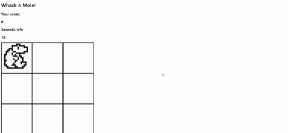

# 주요 개념

`querySelector()`

`addEventListenter()`

`setInterval()`

`classList`

`forEach()`

`Arrow functions`

`Math.floor`



## 화살표 함수(Arrow functions)

```javascript
let func = function(arg1, arg2, ...argN) {
    return expression;
}
```

의 형태를

```javascript
let func = (arg1, arg2, ...argN) => expression
```

로 바꾸는 것


```javascript
let sum = (a, b) => a + b;
```

```javascript
let sum = funcion(a, b) {
    return a + b;
}
```

위 두 함수는 같다.

- 무명 함수의 키워드 `function` 삭제

- 함수의 바디가 `return`을 포함한 표현식 1개일 경우만

  `{}`와 `return` 삭제

- 매개변수가 2개이므로 `()`는 삭제되지 않았음


매개변수가 1개일 때, 매개변수를 감싸는 괄호를 생략 가능하다.

```javascript
let double = n => n * 2;
// let double = function(n) { return n * 2 }와 거의 동일
```


인수가 하나도 없을 땐 괄호를 비워놓으면 되지만, 괄호를 생략할 수는 없다.

```javascript
let sayHi = () => alert("안녕");

sayHi();
```


함수 본문이 한 줄인 간단한 함수는 화살표 함수를 사용해서 만드는 게 편리하다.

```javascript
let age = prompt("나이를 입력", 18);

let welcome = (age < 18) ?
    () => alert("안녕") : // 한 줄짜리 간단한 함수
	() => alert("안녕하십니까"); // 한 줄짜리
// 참이면 안녕, 거짓이면 안녕하십니까
// 인수를 필요로 하는함수가 아니므로 ()를 비우되 생략하지는 않음.

welcome();
```


```javascript
let sum = (a, b) => {
    let result = a + b;
    return result; // 중괄호를 사용했다면, return 지시자로 결과값을 명시적으로 반환해야 함.
};

alert( sum(1, 2) ); // 3
```


## 어림수 구하기

> 어림수 관련 내장 함수

- `Math.floor` : 소수점 첫째 자리*에서 내림*.

  `3.1`은 `3`, `-1.1`은 `-2`

- `Math.ceil` : 소수점 첫째 자리*에서 올림*.

  `3.1`은 `4`, `-1.1`은 `-1`

- `Math.round` : 소수점 첫째 자리*에서 반올림*.

  `3.1`은 `3`, `3.6`은 `4`, `-1.1`은 `-1`

- `Math.trunc` : 소수부를 *무시한다*.

  `3.1`은 `3`, `-1.1`은 아예 `-1`

  

### 첫째 자리가 아니라 `n`번째 자리에서 어림수를 구하고 싶다면?

> `toFixed(n)` : 소수점 `n`번째 수까지의 어림수를 구한 후 문자형으로 반환하는 메서드
>
> `Math.round`와 유사함. 가장 가까운 값으로 올림/버림.

```javascript
let num = 12.34;

// 1째 자리`까지` 가장 가까운 값으로 올림 버림(반올림과 유사) 후 "문자열"로 반환
num.toFixed(1); // "12.3"
```

```javascript
let num = 12.36;

num.toFixed(1); // "12.4"
```


- 소수부의 길이가 인수보다 작으면 끝에 `0`을 추가하고, 어림수 연산

    ```javascript
    let num = 12.34;
    num.toFixed(5); // 5째 자리까지 어림수 구해야 하므로 0을 추가
    // 12.34000
    ```


- `+num.toFixed(5)`처럼 단항 덧셈 연산자를 붙이거나<br>

​	`Number()`를 호출하여 문자형의 숫자를 <u>숫자형으로 변환 가능</u>

```javascript
let sum = 0.1 + 0.2;
+sum.toFixed(2); // 0.3

소수부가 인수보다 작아 0을 추가한 값 0.30이 반환되어야 하지만, 단항 덧셈연산자로 숫자형변환이 일어나 0.3만 반환
```


- `Math.random()`

  *<u>0과 1 사이</u>의 난수를 반환*(1은 제외)

  ```javascript
  Math.floor(Math.random())
  // 0과 1 사이의 난수를 뽑아서 소수 첫째자리 올림
  ```


## `setInterval()` & `clearInterval()`

> `setTimeout`과 동일한 문법

> `setTimeout`이 함수를 단 한 번만 실행하는 것과 달리<br>`setInterval`은 함수를 *주기적으로* 실행한다.


```javascript
// 2초 간격으로 째깍
let timerId = setInterval( () => alert('째깍'), 2000 );

// 5초 후에 정지
setTimeout( () => {
    // 5초 후에 '2초 간격 정지' 함수에서 clearInterval하고,
    clearInterval(timerId);
    // '정지' 메시지 띄우기
    alert('정지');
}, 5000 );
```


### `setInterval`과 중첩 `setTimeout()`

```javascript
let timerId = setInterval( () => alert('째깍'), 2000 )
```

```javascript
let timerId = setTimeout( function tick() {
    alert('째깍');
    
    // 2초 뒤에 tick 함수 실행
    timerId = setTimeout(tick, 2000);
    // 하고나면 다음 호출을 스케줄링
}, 2000);
```

위 두 코드의 결과는 같다. (2초 간격으로 함수를 실행한다)


```
https://blog.webi.kr/34
```


# 시도 실패) 두더지 여러 마리 만들기

> 두더지를 때렸을 때 점수가 추가되게하는 로직 구현 실패


- `function randomSquare()`

  ```javascript
  // randomSquare 함수 선언
  function randomSquare() {)
      let randomPosition = square[Math.floor(Math.random() * 9)]
      // 뽑힌 randomPosition 자리에 두더지가 뜨도록 한다.
      randomPosition.classList.add('mole')
  
      hitPosition = randomPosition.id;
      
      // 1초 ~ 1.5초 사이 랜덤 시간이 지나면, 두더지를 제거한다.(화면에 여러 마리의 두더지 등장)
      setTimeout(() => { randomPosition.classList.remove('mole') }, randomTime(1000, 1500))
      return hisPosition
  }
  ```

  

- `function randomTime(min, max)`

  ```javascript
  // 최소 1초 ~ 최대 3초까지의 등장 시간 간격을 뽑는 함수
  function randomTime(min, max) {
      return (min + Math.random() * (max - min)).toFixed(2);
  }
  ```


- `addEventListener('mouseup', () => {})`

  ```javascript
  // 두더지를 잡으면 점수 추가
  square.forEach(id => {
      // 의미 : square의 각 요소를 id라고 하고,
      // 그 요소에 mouseup이라는 이벤트가 발생하면,
      // 콜백함수를 실행
      id.addEventListener('mouseup', () => {
          // mouseup 이벤트가 일어난 요소의 id값과 두더지가 나타난 칸의 id가 동일하면
          if (id.id === randomSquare()) {
              // result + 1
              result = result + 1
              score.textContent = result
          }
      })
  })
  ```

  ```javascript
  🥔 오류 시점 🥔
   목표 : 현재 hitPosition인 칸을 누르면 점수가 올라간다.
   오류 : 점수 주는 칸 따로 있고, 두더지 뜨는 칸 따로 있는 현상
   
   위 로직은 randomSquare 함수가 Interval로 의해 호출될 때마다 randomSquare()의 반환값인 hitPoint가 현재 이벤트가 발생한 칸인지 확인하고, 점수를 올리는 구조이다.(두더지가 화면에 한 칸씩만 등장할 경우 문제 없음                                   hitPosition: 1칸, 두더지: 1칸)
   하지만 randomSquare 함수에서 setTimeout()을 선언해놓았기 때문에, 두더지가 지속되는 칸은 화면에서 여러 칸이지만, 실제 hitPosition은 하나라서, 두더지가 떠있는 칸을 눌러도 hitPosition이 할당되지 않았기 때문에 result 점수가 올라가지 않는다. (hitPosition: 1칸, 두더지: 여러 칸)
  ```


- `function CountDown()`

  ```javascript
  // 카운트다운 함수
  function countDown() {
      currentTime--
      timeLeft.textContent = currentTime
  
      if (currentTime === 0) {
          clearInterval(secondsLeft)
          clearInterval(timerId)
          alert('게임 종료! 당신의 점수는 ' + result + '점입니다!')
      }
  }
  ```

  ```javascript
  let secondsLeft = setInterval(countDown, 1000);
  ```

  
