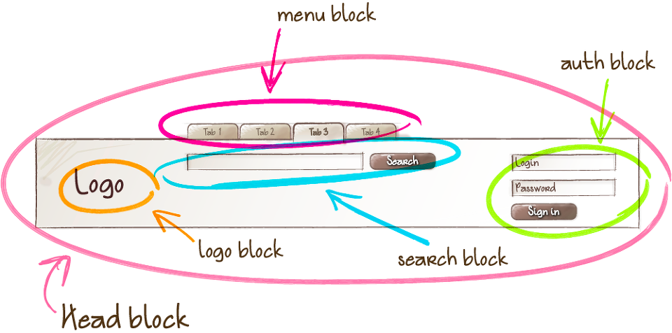

# ✔ 제주맥주 사이트 - 홈페이지 클론코딩

🔸 제주맥주 사이트: https://jejubeer.co.kr/2022barrelseries

🔸 클론코딩 과제 수행 조건
- 개발자 도구 켜서 코드 따라치기 금지 (이미지 url 사용은 허용)
- 부트스트랩 등 라이브러리 사용 금지 (오로지 바닐라 자바스크립트로!)
- CSS 방법론을 이용해 클래스명 정하기


## 📝 CSS 방법론 요약.정리

> CSS 방법론 참고: https://whales.tistory.com/33 <br>
> BEM 방법론 참고1: https://whales.tistory.com/2 <br>
> BEM 방법론 참고2: https://nykim.work/15 <br>
> BEM 방법론 참고3: https://naradesign.github.io/bem-by-example.html <br>
> BEM 방법론 참고4: https://9elements.com/bem-cheat-sheet/ 

> 📌 내가 적용한 CSS 방법론: `BEM 방법론`

### 1️⃣ OOCSS (Object Oriented CSS) 

- 객체 지향에 따라서 고안된 설계 방식
 
- 특징1) 구조와 외형을 분리
   - 구조: width, height, border, padding, margin 등
   - 외형: color, border-color, font-color, background-color 등
   
     ```html
     <div class="btn common-skin tel">tel</div>
     <div class="btn common-skin email">email</div>
     ```

     ```css
     .btn { 공통 스타일 정의 } 
     .common-skin { 공통 스타일 정의 }
     ```

- 특징2) 컨테이너와 내용을 분리
   - 위치에 의존하지 않는 스타일 정의
   - 어떤 태그라도 동일한 외형 제공
   - 재사용이 가능한 클래스 기반 모듈 구축

     ```html
     <h3 class="sub-title"> ... </h3> 
     <span class="sub-title"> ... </span>
     ```

     ```css
     /* Bad */
     h3 { font-size:16px }

     /* Good */
     .sub-title { font-size:16px }
     ```

- 장점
   - 공통된 부분을 정의해서 재사용이 가능
   - 구조적 상황에 관계없이 동일한 클래스라면 동일한 스타일을 기대할 수 있음
   - 코드의 재사용으로 코드 양이 줄어듦

- 단점
   - 공통된 클래스가 많기 때문에 수정이 발생할 시 멀티클래스를 사용해야 함
   - 멀티클래스가 많아짐에 따라 유지보수에 어려움
   - 코드의 가독성이 떨어짐

### 2️⃣ BEM (Block Element Modifier)

- Block, Element, Modifier로 나누어서 클래스명을 기술하는 방법
   - block(전체를 감싸고 있는 블록 요소)
   - element(내부 요소)
   - modifier(기능/수정)
   - `block__element--modifier`
   - block과 element는 더블 언더스코어`__`로, modifier는 더블 하이픈`--`으로 연결

- Block (전체를 감싸고 있는 블럭요소)
   - 문단 전체에 적용된 요소 또는 요소를 담고 있는 컨테이너
     - 재사용 가능한 기능적으로 **독립적**인 page component
     - 즉, 그루핑 요소의 가장 최상위 요소
     - ex) 헤더, 풋터, 사이드바, 메인 콘텐츠 등의 영역
      
        
   
   - 클래스의 어근을 형성하고 항상 맨 앞에 위치

      ```css
      .header { 스타일 } 
      .menu { 스타일 } 
      .logo { 스타일 } 
      ```

- Element (요소)
   - 블록이 포함하고 있는 한 조각
     - 블럭에 **의존적**인 형태
     - 즉, 블록을 구성하는 한 요소 단위

        

   - 요소는 두 개의 underscore로 연결하여 블록 다음에 위치

      ```css
      .header__logo { 스타일 } 
      .header__tagline { 스타일 }
      .header__searchbar { 스타일 }
      .header__navigation { 스타일 }
      ```

- Modifiers (속성 / 수정)
   - 블록이나 요소의 속성 (외관이나 상태를 변화시키는 것)
     - 특정 요소의 스타일을 수정할 필요가 있을 때, modifier를 활용
     - 생긴 게 조금 다르거나, 다르게 동작하는 블럭이나 요소를 만들 때 사용
  
        

   - modifier는 두 개의 하이픈으로 연결하여 블록이나 요소 다음에 위치

      ```css
      .block‐‐modifier { 스타일 } 
      .block__element‐‐modifier { 스타일 }
      ```
  
   - modifier 타입
     - 불리언(boolean) 타입: 그 값이 true라고 가정하고 사용
     - 키-밸류(key-value) 타입: 하이픈으로 `성질`-`내용`을 작성
  
       ```css
       /* 불리언(boolean) 타입 */
       .tab__item--focused { 스타일 } 
       .form-login--disabled { 스타일 } 

       /* 키-밸류(key-value) 타입 */
       .title--color-gray { 스타일 } 
       .form-login--theme-normal { 스타일 } 
       .form-login--theme-special { 스타일 } 
       ```

- 예시

  ```html
  <form class="search-form">
    <div class="search-form__content">
        <input class="search-form__input"/>
        <button class="search-form__button">Search</button>
    </div>
  </form>
  ```
  
  ```html
  <ul class="tab">
    <li class="tab__item tab__item--focused">탭 01</li>
    <li class="tab__item">탭 02</li>
    <li class="tab__item">탭 03</li>
  </ul>
  ```

  ```html
  <div class="column">
    <strong class="title">일반 로그인</strong>
    <form class="form-login form-login--theme-normal">
      <input type="text" class="form-login__id"/>
      <input type="password" class="form-login__password"/>
    </form>
  </div>
  
  <div class="column">
    <strong class="title title--color-gray">VIP 로그인 (준비중)</strong>
    <form class="form-login form-login--theme-special form-login--disabled">
        <input type="text" class="form-login__id"/>
        <input type="password" class="form-login__password"/>
    </form>
  </div>
  ```

- 태그명이나 id를 사용하지 않고 오직 클래스명만 사용
   - 클래스명은 간단하고 직관적이며 유니크한 이름을 사용하는 것이 좋음

      ```css
      /* Bad (태그 변경시 전체적으로 수정이 발생하여 비효율적) */
      .header__search p { 스타일 }

      /* Good (수정이 발생해도 무방) */
      .header__search--form  { 스타일 }
      ```

- 일반적으로 추가적인 클래스를 만들거나 똑같은 스타일을 반복해서 사용하지 않음 (Sass의 @extend 활용)

- 장점
   - 직관적인 클래스명으로 마크업 구조를 직접 보지 않아도 구조의 파악이 쉬움
   - 재사용 가능
   - 작성된 SASS에서 요소를 쉽게 찾을 수 있음
     - ex) `.header` 아래에 `&__logo`, `&__search`: '헤더 아래 로고'와 '헤더 아래 검색'
   - nested 방식으로 SASS 작성 시, 늘어지는 셀렉팅을 막아줌
     - BEM 방법을 쓰면, 모두 요소라서 깊게 nested 할 필요가 없어짐
     - ex) `.header .nav .list .item .link`
  
        ```css
        /*기존에 쓰던 방식*/
        .header {
          .nav {
              position: absolute;
              .list {
                list-style: none;
              }
              .item {
                /*너무 길어진다 싶을 때만 밖으로(근본없는 들여쓰기!)*/
                outline: 0;
                .link {
                    color: red;
                }
              }
          }
        }
        
        /*BEM*/
        .header {
          &__nav {
              position: absolute;
          }
          &__list {
              color: red;
          }
          &__item {
              /*여기 있는 모든 요소들은 블럭 내의 엘리먼트이기 때문에 캐스케이딩과 무관하게 병렬 작성*/
              outline: 0;
          }
          &__link {
              color: red;
          }
        }
        ```

- 단점
   - 클래스명이 상대적으로 길어질 수밖에 없는 구조이기 때문에 코드가 길어지고 복잡해짐
   - 기존 마크업에서 새롭게 기능이 추가되었을 경우 클래스명 재수정이 불편

### 3️⃣ SMACSS (Scalable and Modular Architecture for CSS)

- CSS에 대한 확장형 모듈식 구조의 형태
- 5개의 구분된 카테고리 존재
  - Base (기본 규칙)
  - Layout (레이아웃 규칙)
  - Module (모듈 규칙)
  - State (상태 규칙)
  - Theme (테마 규칙)

- Base (기본 규칙)
  - 각 브라우저의 기본 스타일 (default.css, reset.css), 요소 element 스타일의 기본 정의 값

- Layout (레이아웃 규칙)
  - 큰 틀의 레이아웃
  - 요소를 배치/구별하는데 적용
  - 주요 컴포넘트 : header, footer, aside, container, content 등
  - 하위 컴포넘트 : list, item, form 등

- Module (모듈 규칙)
  - 페이지에서 재사용 가능한 요소 : 버튼, 배너, 아이콘, 박스 요소 등
  - 각 모듈은 독립성을 가지게 스타일 선언
  - 재사용이 가능하게 id, 태그 선택자는 사용하지 않음

- State (상태 규칙)
  - 요소의 상태 변화를 표현하는 요소 : 툴팁, 아코디언 등
  - active, disable 등
  - `is-`나 `s-`를 붙여서 사용

- Theme (테마 규칙)
  - 사용자가 선택 가능하도록 스타일을 재선언하여 사용
  - 접두사 `theme-`를 붙여서 사용

- 장점
  - 클래스명을 통한 예측의 용이성
  - 재사용을 통한 코드의 간결화
  - 확장의 용이성

- 단점
  - 카테고리를 나누는 기준이 작성사에 따라서 불분명할 수 있음
  - 코드를 나누어서 작성해야 하기 때문에 CSS를 사용하기 번거로움
  - 잘못 사용하면 오히려 의도와 다르게 코드가 더 복잡해짐


## 💡 후기

### 1) 내가 작성한 코드 vs 개발자 검사 코드


### 2) BEM 방법론 적용 후기

원래 나는 클래스명을 지정할 때 이후의 유지보수를 생각하지 않고 마음대로 이름을 정의했었다. 그래서 그런지 나중에 코드를 수정할 때 상당히 번거롭고 복잡했던 기억이 있다. 다음 프로젝트땐 처음부터 클래스명을 체계적으로 작성해봐야겠다 생각만 하고 있다가, 이번 스터디 과제를 통해 CSS 방법론이라는 것을 처음 알게 되었다.

CSS 방법론 중 BEM 방법론을 사용해 클론코딩을 진행해봤는데, 아직은 내가 BEM 방법론에 따라 적절히 클래스명을 지정하고 있는지 모르겠다. 의도치않게 OOCSS 방법론과 BEM 방법론을 혼용한 것 같기도 하다. BEM 방법론에서 block이 '재사용 가능한 기능적으로 **독립적**인 page component'라고 하는데, 이는 OOCSS 방법론에서 공통된 클래스를 정의한 후 재사용하는 것과 동일한 것이 아닌가하는 생각이 든다. 

재사용 가능하고 독립적인 block이 어떤 것이 있을까 생각해보다가 Navbar, Dropdowns, Carousel 등과 같은 UI 컴포넌트가 아닐까싶어 부트스트랩 문서의 components 부분을 다시 찾아보았다. 부트스트랩 문서에 나와있는 components 외에도 어떤 것들이 있을까 궁금해 구글링해보았고 아래의 자료들을 통해 다양한 컴포넌트를 알 수 있었다. 이를 바탕으로, 클론코딩 페이지에서 컴포넌트처럼 보이는 것들은 block으로 지정하고 클래스명을 지었다.

유지보수를 위해 CSS 네이밍 컨벤션을 논리적으로 잘 작성하는 것이 얼마나 중요하고 어려운지 깨닫게 되는 시간이었다.


> UI 컴포넌트 종류 참고 자료
- [부트스트랩 Components](https://getbootstrap.com/docs/5.2/components/accordion/)
- [네이버 - 기획자들이 알아야 할 UI 기본 용어](https://m.post.naver.com/viewer/postView.naver?volumeNo=33239462&memberNo=31117780)
- [구글 - Material Design 3의 UI Components](https://m3.material.io/components)
- [씨앤텍시스템즈 기술 블로그 - UI Components](https://cntechsystems.tistory.com/148)
- [component gallery](https://component.gallery/components/)


### 3) 아쉬운점

현재 s3의 carousel 구현을 완성하지 못했다. 이 부분은 코드 전부를 뜯어고쳐야할 것 같다... 혼자 캐러셀을 구현해보려 했지만, 아무래도 구현하기가 쉽지 않은 부분인 것 같다. 구글링으로 다른 사람의 완성된 코드를 보고 다시 조합해서 구현해봐야겠다.

s1/s5의 slider와 s3의 carousel을 하나로 합쳐서 컴포넌트화할 수 있을 것 같은데, 캐러셀 구현이 처음이다 보니 어떻게 합칠 수 있을지 아직 감이 잡히지 않는다. [부트스트랩 문서](https://getbootstrap.com/docs/5.2/components/carousel/), [swiper 문서](https://swiperjs.com/demos), [slick 문서](https://kenwheeler.github.io/slick/)를 보면서 좀 더 연구해 봐야할 것 같다.

> 나중에 참고할 슬라이드 관련 자료
- <https://mong-blog.tistory.com/entry/carousel-slider-%EB%A7%8C%EB%93%A4%EA%B8%B0-with-js>
- <https://junjangsee.tistory.com/entry/%EC%99%84%EC%A0%84-%EC%B4%88-%EB%8B%A8%EC%88%9C%ED%95%98%EA%B2%8C-%EC%BA%90%EB%9F%AC%EC%85%80Carousel-%EA%B5%AC%ED%98%84%ED%95%B4%EB%B3%B4%EA%B8%B0>
- <https://code.tutsplus.com/ko/tutorials/create-the-perfect-carousel-part-1--cms-29481>
- <https://nohack.tistory.com/126>