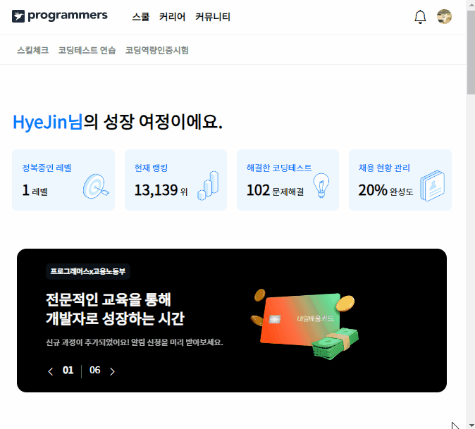
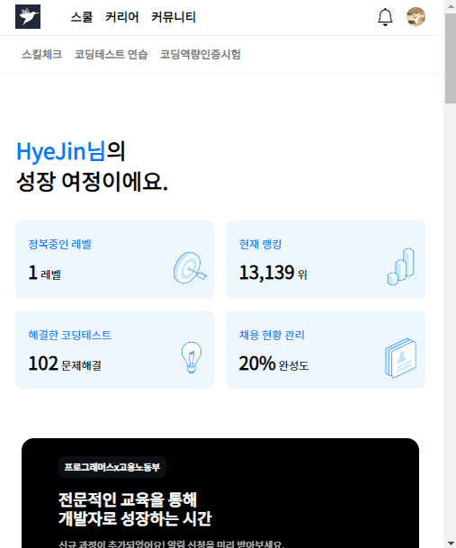

# ✔ 프로그래머스 사이트 - 홈페이지 클론코딩

🔸 프로그래머스 사이트: https://programmers.co.kr/ (로그인된 화면)

🔸 클론코딩 과제 수행 조건
- 개발자 도구 켜서 코드 따라치기 금지 (이미지 url 사용은 허용)
- 부트스트랩 등 라이브러리 사용 금지 (오로지 바닐라 자바스크립트로!)
- css 방법론을 적용한 후, md문서에 1) 어떤 방법론을 사용했고, 2) 자신이 사용한 css 방법론에 대한 간략한 설명을 적기 (10줄 이상)
- 변형 없이 똑같이 만들기
- 반응형 고려 (mobile, tablet, laptop 크기)
- 기능별로 커밋


## ⭐ 클론코딩 완성본

### 1️⃣ laptop 크기


### 2️⃣ tablet 크기



### 3️⃣ mobile 크기




## 📝 CSS 방법론 요약.정리

> 📌 내가 적용한 CSS 방법론: `BEM 방법론`

### ▶ BEM (Block Element Modifier)

- Block, Element, Modifier로 나누어서 클래스명을 기술하는 방법
   - block(전체를 감싸고 있는 블록 요소)
   - element(내부 요소)
   - modifier(기능/수정)
   - `block__element--modifier`
   - block과 element는 더블 언더스코어`__`로, modifier는 더블 하이픈`--`으로 연결

- Block (전체를 감싸고 있는 블럭요소)
   - 문단 전체에 적용된 요소 또는 요소를 담고 있는 컨테이너
     - 재사용 가능한 기능적으로 **독립적**인 page component
     - 즉, 그루핑 요소의 가장 최상위 요소
     - ex) 헤더, 풋터, 사이드바, 메인 콘텐츠 등의 영역
      
        
   
   - 클래스의 어근을 형성하고 항상 맨 앞에 위치

      ```css
      .header { 스타일 } 
      .menu { 스타일 } 
      .logo { 스타일 } 
      ```

- Element (요소)
   - 블록이 포함하고 있는 한 조각
     - 블럭에 **의존적**인 형태
     - 즉, 블록을 구성하는 한 요소 단위

        

   - 요소는 두 개의 underscore로 연결하여 블록 다음에 위치

      ```css
      .header__logo { 스타일 } 
      .header__tagline { 스타일 }
      .header__searchbar { 스타일 }
      .header__navigation { 스타일 }
      ```

- Modifiers (속성 / 수정)
   - 블록이나 요소의 속성 (외관이나 상태를 변화시키는 것)
     - 특정 요소의 스타일을 수정할 필요가 있을 때, modifier를 활용
     - 생긴 게 조금 다르거나, 다르게 동작하는 블럭이나 요소를 만들 때 사용
  
        

   - modifier는 두 개의 하이픈으로 연결하여 블록이나 요소 다음에 위치

      ```css
      .block‐‐modifier { 스타일 } 
      .block__element‐‐modifier { 스타일 }
      ```
  
   - modifier 타입
     - 불리언(boolean) 타입: 그 값이 true라고 가정하고 사용
     - 키-밸류(key-value) 타입: 하이픈으로 `성질`-`내용`을 작성
  
       ```css
       /* 불리언(boolean) 타입 */
       .tab__item--focused { 스타일 } 
       .form-login--disabled { 스타일 } 

       /* 키-밸류(key-value) 타입 */
       .title--color-gray { 스타일 } 
       .form-login--theme-normal { 스타일 } 
       .form-login--theme-special { 스타일 } 
       ```

- 예시

  ```html
  <form class="search-form">
    <div class="search-form__content">
        <input class="search-form__input"/>
        <button class="search-form__button">Search</button>
    </div>
  </form>
  ```
  
  ```html
  <ul class="tab">
    <li class="tab__item tab__item--focused">탭 01</li>
    <li class="tab__item">탭 02</li>
    <li class="tab__item">탭 03</li>
  </ul>
  ```

  ```html
  <div class="column">
    <strong class="title">일반 로그인</strong>
    <form class="form-login form-login--theme-normal">
      <input type="text" class="form-login__id"/>
      <input type="password" class="form-login__password"/>
    </form>
  </div>
  
  <div class="column">
    <strong class="title title--color-gray">VIP 로그인 (준비중)</strong>
    <form class="form-login form-login--theme-special form-login--disabled">
        <input type="text" class="form-login__id"/>
        <input type="password" class="form-login__password"/>
    </form>
  </div>
  ```

- 태그명이나 id를 사용하지 않고 오직 클래스명만 사용
   - 클래스명은 간단하고 직관적이며 유니크한 이름을 사용하는 것이 좋음

      ```css
      /* Bad (태그 변경시 전체적으로 수정이 발생하여 비효율적) */
      .header__search p { 스타일 }

      /* Good (수정이 발생해도 무방) */
      .header__search--form  { 스타일 }
      ```

- 일반적으로 추가적인 클래스를 만들거나 똑같은 스타일을 반복해서 사용하지 않음 (Sass의 @extend 활용)

- 장점
   - 직관적인 클래스명으로 마크업 구조를 직접 보지 않아도 구조의 파악이 쉬움
   - 재사용 가능
   - 작성된 SASS에서 요소를 쉽게 찾을 수 있음
     - ex) `.header` 아래에 `&__logo`, `&__search`: '헤더 아래 로고'와 '헤더 아래 검색'
   - nested 방식으로 SASS 작성 시, 늘어지는 셀렉팅을 막아줌
     - BEM 방법을 쓰면, 모두 요소라서 깊게 nested 할 필요가 없어짐
     - ex) `.header .nav .list .item .link`
  
        ```css
        /*기존에 쓰던 방식*/
        .header {
          .nav {
              position: absolute;
              .list {
                list-style: none;
              }
              .item {
                /*너무 길어진다 싶을 때만 밖으로(근본없는 들여쓰기!)*/
                outline: 0;
                .link {
                    color: red;
                }
              }
          }
        }
        
        /*BEM*/
        .header {
          &__nav {
              position: absolute;
          }
          &__list {
              color: red;
          }
          &__item {
              /*여기 있는 모든 요소들은 블럭 내의 엘리먼트이기 때문에 캐스케이딩과 무관하게 병렬 작성*/
              outline: 0;
          }
          &__link {
              color: red;
          }
        }
        ```

- 단점
   - 클래스명이 상대적으로 길어질 수밖에 없는 구조이기 때문에 코드가 길어지고 복잡해짐
   - 기존 마크업에서 새롭게 기능이 추가되었을 경우 클래스명 재수정이 불편


## 💡 후기

### 1) 내가 작성한 코드 vs 개발자 검사 코드


### 2) 슬라이드 구현

> 슬라이드 참고1: [[React]캐러셀 만들기(1)-무한 캐러셀](https://velog.io/@soyeon9819/React%EC%BA%90%EB%9F%AC%EC%85%80-%EB%A7%8C%EB%93%A4%EA%B8%B01-%EB%AC%B4%ED%95%9C-%EC%BA%90%EB%9F%AC%EC%85%80)<br>
> 슬라이드 참고2: [[React]캐러셀 만들기(2)-무한캐러셀(css)](https://velog.io/@soyeon9819/React%EC%BA%90%EB%9F%AC%EC%85%80-%EB%A7%8C%EB%93%A4%EA%B8%B02-%EB%AC%B4%ED%95%9C%EC%BA%90%EB%9F%AC%EC%85%80css)<br>
> 슬라이드 참고3: [(웹) 자바스크립트로 무한 슬라이드 만들기](https://eunhee-programming.tistory.com/m/166)<br>
> cloneNode() 참고: [mdn 문서 - Node.cloneNode()](https://developer.mozilla.org/ko/docs/Web/API/Node/cloneNode) <br>
> setInterval() 참고: [setInterval 내 함수에서 this 사용할 때 주의할 점](https://velog.io/@public_danuel/this-in-setinterval)<br>
> clearInterval() 참고: [setInterval/clearInterval](https://curryyou.tistory.com/328)


### 3) 아쉬운점

'클린 코드 비법을 알려 줄게요', '잘나가는 개발자가 되어보세요' section의 카드 형태 스타일이 서로 비슷했지만, css를 효율적으로 처리하지 못해 중복된 코드가 많았다.

'클린 코드 비법' section 중 '추천 강의' subsection에서 slide-item이 6개 이상이면 slide-box와 slide-list의 길이가 증가하는데, 원인을 아직 찾지 못했다.
'다른 개발자들이 많이 지원한 포지션' section도 마찬가지로 slide-list 길이가 증가한다... 
slide-item 안에 내용을 채우지 않으면 괜찮은데, 채우면 길이가 증간한다..
section__body 클래스를 `display: grid;`를 줘서 그럴 수도 있을 것 같아서 나중에 수정해보고 결과를 확인해봐야겠다.

'성장 여정'에서의 무한 슬라이드와 '클린코드비법'에서의 슬라이드를 하나로 합쳐서 구현하려고 하려다가 코드가 너무 복잡해져 버렸다...